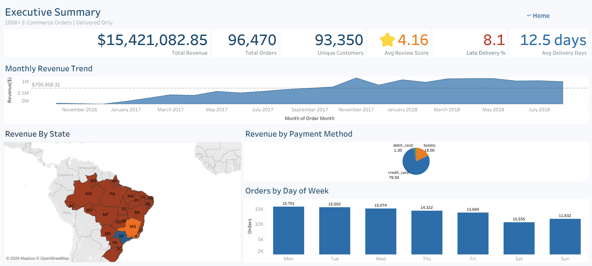
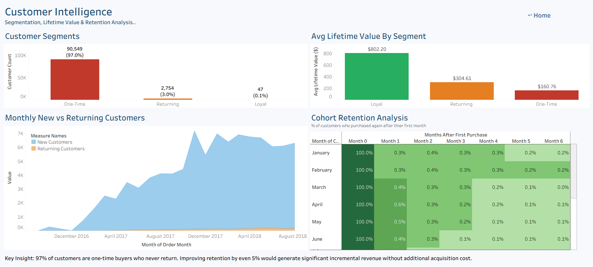
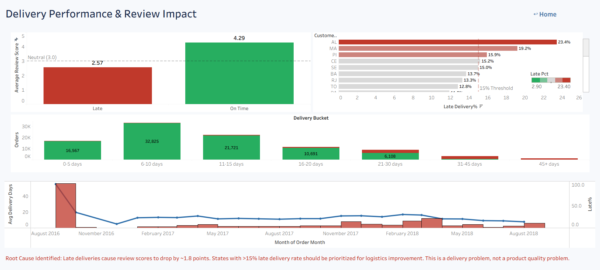
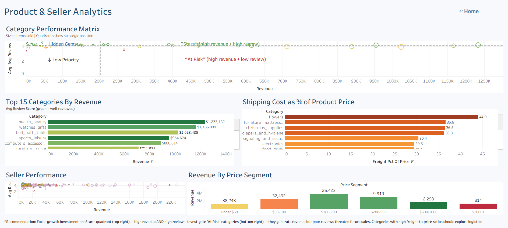
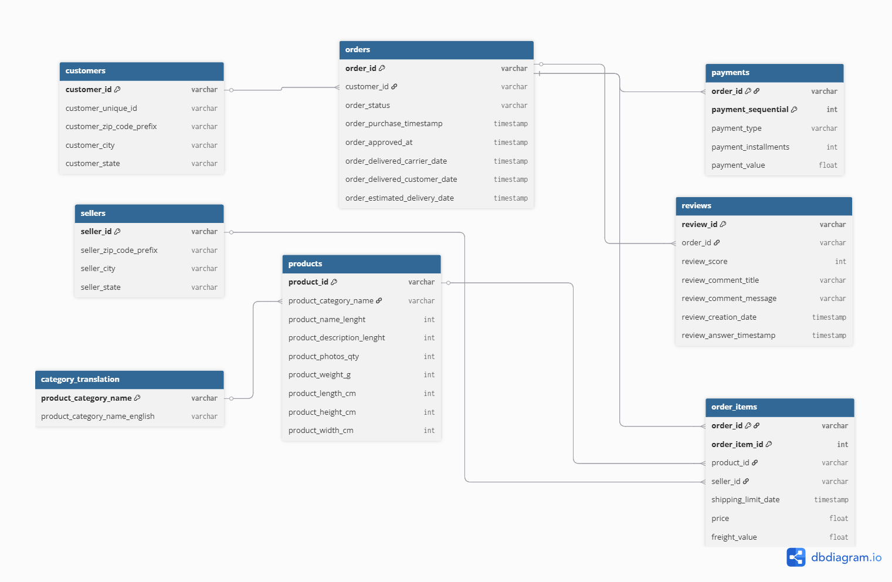
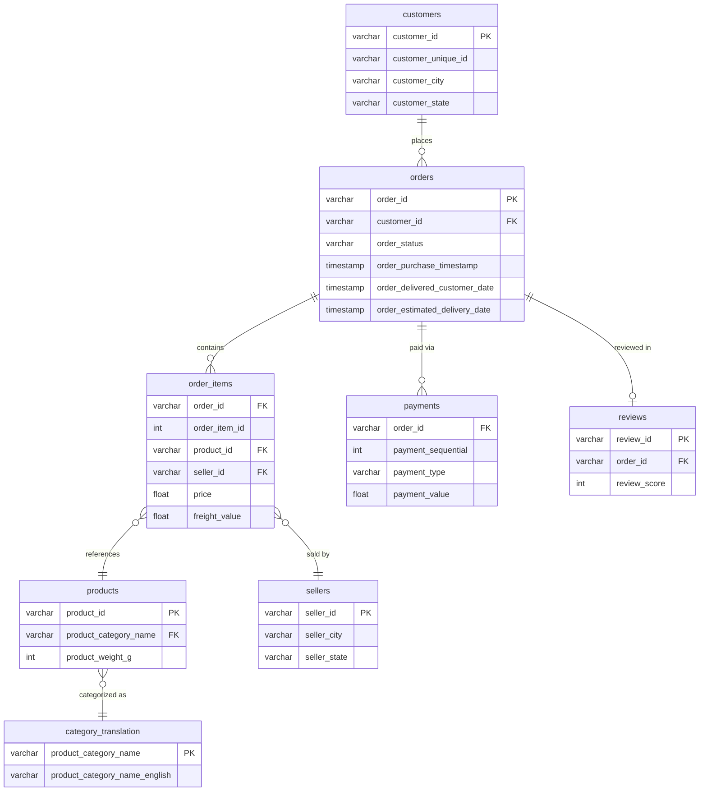

# 📊 E-Commerce Order Analytics — Snowflake + Tableau

> **End-to-end analytics project**: Messy multi-table e-commerce data → Snowflake SQL views → 4 interactive Tableau dashboards answering one business question: **Why aren't customers coming back?**


🔗 **[Live Dashboard on Tableau Public →](https://public.tableau.com/views/EccomerceAnalysisDashboard/ExecutiveSummary?:language=en-US&:sid=&:redirect=auth&:display_count=n&:origin=viz_share_link)**

---

## The Business Problem

A Brazilian e-commerce company (Olist) has **100,000+ orders** across **8 relational tables** — orders, customers, products, sellers, payments, reviews, and geolocation. The data is messy, fragmented, and spread across multiple schemas.

**The question:** Revenue is growing, but customer retention is almost non-existent. Why aren't customers coming back, and what can the business do about it?

---

## Key Findings

| Finding | Insight | Business Impact |
|---------|---------|-----------------|
| **97% of customers are one-time buyers** | Retention is nearly zero — almost no customer purchases twice | A 5% improvement in retention would generate significant incremental revenue without acquisition cost |
| **Late deliveries drop review scores by ~1.7 points** | On-time orders average ⭐ 4.29 vs ⭐ 2.57 for late orders | This is a logistics problem, not a product quality problem |
| **5 states account for majority of late deliveries** | AL (23.4%), MA (19.2%), PI (15.9%) have the worst delivery rates | Targeted logistics improvement in these states would fix the review problem |
| **Credit cards dominate payments (78.5%)** | Boleto (18%) is the only meaningful alternative | Payment diversification could unlock additional customer segments |
| **"Stars" categories drive disproportionate revenue** | Health & beauty, watches, bed/bath generate the most revenue with strong reviews | Double down on these; investigate high-revenue + low-review categories ("At Risk") |

---

## Architecture

```
DATA SOURCE                  WAREHOUSE                    VISUALIZATION
───────────                  ─────────                    ─────────────

Olist Dataset                Snowflake                    Tableau
(8 CSV files,     ──→    ┌──────────────────┐    ──→   4 Interactive
 Kaggle)                 │  RAW Schema       │         Dashboards
                         │  (8 tables)       │         (Published on
 • orders                │        │          │          Tableau Public)
 • customers             │        ▼          │
 • payments              │  ANALYTICS Schema │         • Executive Summary
 • reviews               │  (20 SQL views)   │         • Customer Intelligence
 • order_items           │        │          │         • Delivery & Reviews
 • products              │   ┌────┴─────┐   │         • Product & Seller
 • sellers               │   │          │   │
 • categories            │  Order    Product │
                         │  Grain    Grain   │
                         └──────────────────┘

SQL Features Used: CTEs, Window Functions (LAG, DENSE_RANK, ROW_NUMBER),
                   QUALIFY, CASE WHEN, Conditional Aggregation, Cohort Analysis
```

---

## Dashboards

### 1. Executive Summary
> Revenue trends, geographic distribution, payment analysis, ordering patterns



**KPI cards** showing total revenue ($15.4M), orders (96K), unique customers (93K), and avg review score (4.16). **Monthly revenue trend** with average reference line. **Filled map** of Brazilian states colored by revenue. **Payment breakdown** showing credit card dominance at 78.5%. **Orders by day of week** revealing Monday peaks and Saturday dips.

---

### 2. Customer Intelligence
> Segmentation, lifetime value, new vs returning analysis, cohort retention



**Customer segment breakdown** — 97% are one-time buyers (90,549), only 3% returning (2,754), and 0.1% loyal (47). **Lifetime value comparison** — loyal customers spend $802 vs $160 for one-time. **New vs returning customer trend** over time. **Cohort retention matrix** — the highlight table showing retention drops to <1% after Month 1, proving the retention problem quantitatively.

---

### 3. Delivery & Reviews
> Root cause analysis: late deliveries → bad reviews → customer churn



**The money chart** — side-by-side comparison showing on-time orders average ⭐ 4.29 vs late orders at ⭐ 2.57, with a neutral reference line at 3.0. **Late delivery rate by state** with color gradient (AL leads at 23.4%). **Delivery time distribution** bucketed from 0-5 days through 45+ days. **Monthly delivery trend** (dual-axis) tracking avg delivery days and late percentage over time.

---

### 4. Product & Seller Analytics
> Category performance matrix, top products, pricing and freight analysis



**Category performance matrix** (scatter 2×2) — revenue vs avg review with quadrant annotations: Stars (top-right), At Risk (bottom-right), Hidden Gems (top-left), Low Priority (bottom-left). **Top 15 categories by revenue** colored by review score. **Seller performance scatter**. **Revenue by price segment**. **Shipping cost as % of product price** — flowers (44%), furniture (36.6%) have the highest freight burden.

---

## Data Model

### ER Diagram




### View Architecture

I designed **two base views** at different grains, plus **18 aggregated views** for specific dashboard needs:

| View | Grain | Purpose | Key SQL Techniques |
|------|-------|---------|-------------------|
| `v_order_analytics` | 1 row per order | Revenue, delivery, customer analysis | CTEs, QUALIFY, ROW_NUMBER, CASE |
| `v_product_analytics` | 1 row per item per order | Product category, seller analysis | Multi-table JOINs, COALESCE |

**Why two grains?** An order can have multiple items. Forcing product data into order grain (by taking `FIRST_VALUE`) would silently drop items 2, 3, 4... and skew category revenue analysis. Keeping separate grains ensures analytical accuracy.

**Aggregated views (18 total):**

| Dashboard | Views | What They Power |
|-----------|-------|-----------------|
| Executive Summary | `v_exec_kpis`, `v_monthly_revenue`, `v_revenue_by_state`, `v_payment_breakdown`, `v_orders_by_day` | KPI cards, trend chart, map, pie, bar |
| Customer Intelligence | `v_customer_segments`, `v_segments_by_state`, `v_new_vs_returning`, `v_cohort_retention` | Segment bars, stacked area, retention matrix |
| Delivery & Reviews | `v_delivery_impact`, `v_state_delivery`, `v_delivery_distribution`, `v_monthly_delivery` | Impact bars, state bars, histogram, dual-axis trend |
| Product & Seller | `v_category_performance`, `v_category_monthly`, `v_seller_performance`, `v_price_segments`, `v_freight_ratio` | Scatter 2×2, category bars, seller scatter, price/freight analysis |

---

## SQL Highlights

### Cohort Retention Analysis
```sql
-- Monthly cohort: what % of customers return after first purchase?
WITH first_purchase AS (
    SELECT
        customer_unique_id,
        DATE_TRUNC('month', MIN(order_purchase_timestamp)) AS cohort_month
    FROM v_order_analytics
    GROUP BY customer_unique_id
)
SELECT
    fp.cohort_month,
    COUNT(DISTINCT fp.customer_unique_id) AS cohort_size,
    COUNT(DISTINCT CASE
        WHEN DATEDIFF('month', fp.cohort_month, 
             DATE_TRUNC('month', o.order_purchase_timestamp)) = 1
        THEN o.customer_unique_id END) AS month_1,
    -- ... through month_6
FROM first_purchase fp
JOIN v_order_analytics o ON fp.customer_unique_id = o.customer_unique_id
GROUP BY fp.cohort_month
HAVING cohort_size > 10;
```

### Payment Type Logic (Why Not Just MAX?)
```sql
-- WRONG: MAX(payment_type) gives alphabetically last — meaningless
-- RIGHT: Take the payment type with the highest payment value
MAX_BY(PAYMENT_TYPE, PAYMENT_VALUE) AS PRIMARY_PAYMENT_TYPE
```

### Window Functions for MoM Growth
```sql
LAG(SUM(TOTAL_PAYMENT)) OVER (ORDER BY ORDER_MONTH) AS PREV_MONTH_REVENUE,
ROUND(
    (SUM(TOTAL_PAYMENT) - LAG(SUM(TOTAL_PAYMENT)) OVER (ORDER BY ORDER_MONTH))
    / NULLIF(LAG(SUM(TOTAL_PAYMENT)) OVER (ORDER BY ORDER_MONTH), 0) * 100
, 1) AS MOM_GROWTH_PCT
```

---

## Design Decisions

| Decision | What I Chose | Why |
|----------|-------------|-----|
| Views in Snowflake, not Custom SQL in Tableau | Snowflake views | Separation of concerns — SQL logic is version-controlled, reusable, and maintainable. Tableau is just the display layer. |
| Two base views at different grains | Order grain + Item grain | Prevents silent data loss from forcing multi-item orders into one row. Category revenue is accurate. |
| `QUALIFY ROW_NUMBER()` for review dedup | Snowflake-native syntax | Cleaner than self-join or subquery. Picks latest review per order. |
| `MAX_BY()` for primary payment type | Snowflake-native function | Semantically correct — takes the payment type with the highest value, not alphabetically last. |
| Star emoji (⭐) in KPI cards | Visual hierarchy | Makes the review score KPI visually distinct and immediately recognizable. |
| Cohort retention as highlight table | Color-coded matrix | Industry-standard format for retention analysis. Interviewers recognize it instantly. |

---

## Project Structure

```
ecommerce-analytics/
│
├── README.md                          ← you are here
├── data_dictionary.md                 ← every column in every table explained
│
├── sql/
│   ├── 01_create_tables.sql           ← raw table DDL (Snowflake)
│   ├── 02_base_views.sql              ← v_order_analytics + v_product_analytics
│   ├── 03_dashboard_views.sql         ← all 18 aggregated views
│   └── 04_verification_queries.sql    ← data quality checks
│
├── data/
│   ├── raw/                           ← original Olist CSVs (from Kaggle)
│   │   ├── olist_orders_dataset.csv
│   │   ├── olist_customers_dataset.csv
│   │   ├── olist_order_items_dataset.csv
│   │   ├── olist_order_payments_dataset.csv
│   │   ├── olist_order_reviews_dataset.csv
│   │   ├── olist_products_dataset.csv
│   │   ├── olist_sellers_dataset.csv
│   │   └── product_category_name_translation.csv
│   └── exports/                       ← view outputs as CSVs (backup)
│       ├── v_order_analytics.csv
│       ├── v_product_analytics.csv
│       └── ... (all 20 views exported)
│
├── tableau/
│   └── ecommerce_analytics.twbx       ← packaged Tableau workbook with extracts
│
├── screenshots/
│   ├── 01_executive_summary.png
│   ├── 02_customer_intelligence.png
│   ├── 03_delivery_reviews.png
│   ├── 04_product_seller.png
│   └── 05_navigation.png
│
└── docs/
    └── er_diagram.png                 ← entity relationship diagram
```

---

## Data Dictionary

### Fact: `v_order_analytics` (Order Grain — 96,470 rows)

| Column | Type | Description |
|--------|------|-------------|
| `order_id` | VARCHAR | Unique order identifier (PK) |
| `order_purchase_timestamp` | TIMESTAMP | When the customer placed the order |
| `order_month` | DATE | Truncated to first of month (for grouping) |
| `order_quarter` | INT | Quarter number (1-4) |
| `order_year` | INT | Year (2016-2018) |
| `day_of_week` | VARCHAR | Day name (Mon, Tue, ...) |
| `customer_unique_id` | VARCHAR | Deduplicated customer identifier |
| `customer_city` | VARCHAR | Customer's city |
| `customer_state` | VARCHAR | Customer's state (2-letter code) |
| `customer_order_count` | INT | Total orders by this customer (lifetime) |
| `lifetime_value` | FLOAT | Total spend by this customer across all orders |
| `customer_segment` | VARCHAR | One-Time / Returning / Loyal |
| `items_in_order` | INT | Number of items in this order |
| `distinct_products` | INT | Number of unique products in this order |
| `total_item_price` | FLOAT | Sum of item prices (before freight) |
| `total_freight` | FLOAT | Sum of freight charges |
| `total_payment` | FLOAT | Total payment amount (used for revenue) |
| `primary_payment_type` | VARCHAR | Payment method with highest value in this order |
| `review_score` | INT | 1-5 star rating (NULL if no review) |
| `delivery_days` | INT | Actual delivery time in days |
| `estimated_days` | INT | Estimated delivery time in days |
| `delivery_status` | VARCHAR | "On Time" or "Late" |
| `days_late` | INT | Days past estimated delivery (0 if on time) |

### Fact: `v_product_analytics` (Item Grain — ~112,000 rows)

| Column | Type | Description |
|--------|------|-------------|
| `order_id` | VARCHAR | Order identifier (FK) |
| `order_item_id` | INT | Item sequence within order |
| `product_id` | VARCHAR | Product identifier |
| `category_english` | VARCHAR | Product category in English |
| `item_price` | FLOAT | Price of this specific item |
| `freight_value` | FLOAT | Freight charge for this item |
| `item_total` | FLOAT | Price + freight |
| `seller_id` | VARCHAR | Seller identifier |
| `seller_city` | VARCHAR | Seller's city |
| `seller_state` | VARCHAR | Seller's state |
| `review_score` | INT | Order-level review score |
| `delivery_status` | VARCHAR | "On Time" or "Late" |

---

## How to Reproduce

### Prerequisites
- Snowflake account (free trial: [signup.snowflake.com](https://signup.snowflake.com))
- Tableau Desktop (free student license: [tableau.com/academic](https://www.tableau.com/academic/students)) or Tableau Public
- Dataset: [Brazilian E-Commerce by Olist](https://www.kaggle.com/datasets/olistbr/brazilian-ecommerce) (Kaggle, free)

### Steps

```bash
# 1. Clone this repo
git clone https://github.com/YOUR_USERNAME/ecommerce-analytics.git

# 2. Download Olist dataset from Kaggle → place CSVs in data/raw/

# 3. In Snowflake Worksheet, run SQL scripts in order:
#    sql/01_create_tables.sql    → creates RAW schema tables
#    Upload CSVs via Snowflake UI → Load Data into each table
#    sql/02_base_views.sql       → creates 2 base views in ANALYTICS schema
#    sql/03_dashboard_views.sql  → creates 18 aggregated views
#    sql/04_verification_queries.sql → verify data integrity

# 4. Open Tableau → Connect to Snowflake → ANALYTICS schema
#    Build dashboards using views (or open tableau/ecommerce_analytics.twbx)

# 5. Publish to Tableau Public
```

---

## Tech Stack

| Layer | Technology | Why |
|-------|-----------|-----|
| Data Warehouse | Snowflake | Cloud-native, free trial, SQL-standard, used at Deloitte/consulting |
| SQL | Snowflake SQL | CTEs, window functions, QUALIFY, MAX_BY — demonstrates advanced SQL |
| BI / Visualization | Tableau Desktop + Public | Industry standard for consulting analytics, interactive, publishable |
| Data Source | Kaggle (Olist) | Real-world e-commerce data, 8 relational tables, realistic messiness |
| Version Control | Git + GitHub | SQL scripts, documentation, screenshots — all version-controlled |

---

## What I Learned

1. **Data granularity matters** — my initial design forced all data into order grain, which silently dropped multi-item order details. Splitting into order grain + item grain fixed product category revenue accuracy.

2. **`MAX(payment_type)` is a common mistake** — alphabetical max has no business meaning. `MAX_BY()` picks the payment type with the highest value, which is semantically correct.

3. **SQL views belong in the warehouse, not the BI tool** — Tableau Custom SQL creates maintenance debt. Snowflake views are version-controlled, reusable, and optimize query plans.

4. **Retention analysis reveals what revenue charts hide** — revenue was growing month over month, but 97% of customers never returned. The cohort retention matrix made this invisible problem visible.

5. **Late delivery is a root cause, not a symptom** — correlating delivery status with review scores (4.29 vs 2.57) proved that the company's poor reviews weren't about product quality but logistics.

---

## About

Built by **Sricharan Rachumallu** — MTech Integrated CSE (Data Science), VIT Vellore

This project demonstrates the exact analytics workflow used in consulting: take messy client data, transform it with SQL in a cloud warehouse, build dashboards that answer business questions, and present actionable recommendations.

📧 [your-email@example.com](mailto:sricharanr0509@gmail.com)
🔗 [LinkedIn](https://www.linkedin.com/in/sricharan-r-9551b2229/)
